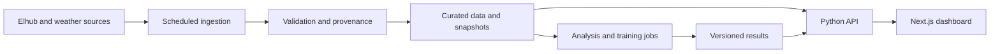

# Norwegian Energy Dashboard — Implementation Plan

Prepared 2026-09-14. This document describes planned work; checked phase items record completed work; the Next.js replacement remains planned.

## 1. Outcome and scope

Build a polished, responsive Norwegian energy and weather analysis product with a Next.js/React frontend and Python backend. Preserve the original dashboard's capabilities while improving data freshness, scientific correctness, usability, and reproducibility.

The public experience should answer three questions: What is happening? What might explain it? How reliably can we forecast it?

- Original repository: https://github.com/TaoM29/data-to-descision-dashboard
- Independent development repository: https://github.com/TaoM29/norwegian-energy-dashboard
- Local development root: `/Users/taom/Projects/norwegian-energy-dashboard`
- Baseline commit: `b3dd41d626153cebce2f2945ad1efc0a195d7bd7`
- The project history and tracked application files are retained, with credentials scrubbed by the 2026-09-14 history rewrite; affected commit IDs changed and the historical secrets file was removed. GitHub issues, settings, releases, and ignored local credentials are not copied by a Git clone.
- All implementation happens in the new repository, directly on `main`; commits and pushes target `origin/main`. Create a separate branch only when the user explicitly requests one. Do not push implementation changes to the original project.

## 2. Architecture decisions

### Agreed direction

- Next.js with React and TypeScript for the public frontend.
- Python for ingestion, statistics, ML, and numerical calculations.
- Reuse the existing analytical functions and meaningful tests.
- Preserve functional coverage; page layout and navigation may change.
- Keep the existing Streamlit implementation runnable during migration. Remove it when replacement features pass their acceptance checks.

### Proposed implementation defaults

- FastAPI for validated query endpoints and an OpenAPI contract. Generate or validate matching TypeScript response types.
- A shared Python analysis package extracted from `app_core` and page-embedded calculations. Remove Streamlit imports, caching decorators, and secrets access from this package.
- Separate commands/jobs for backfill, refresh, training, backtesting, and artifact publication. Browser visits read results rather than fitting models.
- Retain MongoDB behind a storage interface. Phase 1 adds a rebuildable SQLite snapshot for public source data so the app runs without private database access; it does not overwrite MongoDB. Evaluate Parquet/DuckDB with representative analytical queries before selecting the eventual backend.
- Versioned, immutable analysis/forecast artifacts plus a manifest identifying the latest successful release.
- Explicit environment configuration and a redacted `.env.example`; a fixture mode for local setup without credentials.
- Lock dependencies when scaffolding and record supported Python/Node versions. Do not assume the existing minimum versions are a reproducible environment.



Start with one Python service and simple scheduled jobs. Introduce a durable queue only when custom, long-running experiments need one. Choose hosting after checking cold starts, persistent storage, scheduling, operational cost, and secrets management.

Proposed eventual structure (create incrementally):

```text
frontend/                 Next.js application and frontend tests
backend/                  FastAPI routes, schemas, configuration
app_core/                 Framework-independent loaders and analysis
pipelines/                Backfill, refresh, training, publication commands
data/                     Small redistributable fixtures and geography
notebooks/                Exploratory research and reproducible investigations
tests/                    Python correctness and integration tests
docs/                     Architecture, methods, feature parity, decisions
```

## 3. Feature parity inventory

All rows begin as pending. During implementation, record the replacement route, API/function, relevant verification, and migration status. A replacement may combine multiple old pages.

| Existing capability | Existing source | Planned experience / acceptance |
| --- | --- | --- |
| Home, navigation, documentation | `01_Home.py`, `99_About.py` | Overview and Methods & Data; original project provenance remains visible |
| Area, single year, year range | `02_Price_Area_Selector.py` | Global filters backed by actual coverage; state persists in URL; partial years labeled |
| Weather summaries and sparklines | `10_Weather_Overview_Stats_and_Sparklines.py` | Statistics, monthly patterns, wind rose, correct units and missingness |
| Multi-series weather and resampling | `11_Weather_Explorer_Multi_Series_and_Resampling.py` | Select variables, normalize when requested, inspect hourly/daily aggregates |
| Energy production groups | `12_Energy_Production.py` | Group totals, mix and hourly detail; totals reconcile with source fixtures |
| Energy consumption groups | `13_Energy_Consumption.py` | Sector totals and hourly detail with equivalent filters |
| Interactive price-area geography | `20_Price_Areas_Map_Selector.py` | NO1–NO5 map, regional metric comparison, point selection for downstream analysis |
| Tabler snow-drift analysis | `21_Snow_Drift.py` | Point weather, July–June seasons, seasonal/monthly transport, 16-sector rose, parameter controls and units |
| Sliding correlations | `30_Sliding_Correlation.py` | Energy/weather pairing, lag, window and normalization controls, aligned time axes |
| SARIMAX forecasting | `31_SARIMAX_Forecast.py` | Training interval, frequency, model orders, weather inputs, dynamic predictions, forecasts, intervals |
| Forecast evaluation | SARIMAX page and utilities | Rolling origins, seasonal baseline, matched-fold comparisons, MAE/RMSE/MASE, clear failure reporting |
| STL and spectrogram | `40_STL_Decomposition_and_Spectrogram.py` | Components, spectral view and parameter controls with meaningful axis units |
| SPC and LOF | `41_SPC_and_LOF_Data_Quality.py` | Outlier/anomaly controls, contextual plots, scores and interpretation |

Files above live in `pages/`. Keep notebooks as research provenance; their presence does not require linking unfinished experiments in public navigation.

## 4. Phases and completion gates

### Phase 0 — Repository and baseline

- [x] Preserve original Git history and application files; configure only the new repository as `origin`. Verified against the sanitized baseline; see [repository evidence](BASELINE.md#repository-provenance).
- [x] Publish this plan and distinguish the current Streamlit implementation from the planned new application in the README.
- [x] Run the existing tests in a reproducible environment at the start of implementation; record baseline failures separately from regressions. [Python 3.11 baseline](BASELINE.md): 49 passed, no baseline failures; exact installed versions captured.
- [x] Inventory controls, exports, edge cases and page-embedded calculations beyond the initial feature map. See the [control inventory](FEATURE_CONTROL_INVENTORY.md), including corrections from representative runtime checks.
- [x] Capture representative original outputs and timings using known inputs for later comparisons. The [baseline record](BASELINE.md) retains the useful results and identifies the Git commit containing the detailed historical captures.

Gate: **complete 2026-09-14** — independent repository and documented recorded-input baseline; no feature deletion. Live coverage/data correctness and exhaustive replacement parity remain later gates.

### Phase 1 — Data correctness and freshness

- [x] Inspect current Elhub response schemas, pagination/date limits, units and latest complete timestamps for each area/group. Verify actual 2026 records before claiming availability in the app.
- [x] Backfill missing 2025 and available 2026 observations; reconcile overlap with 2021–2024 history.
- [x] Normalize the legacy production collection split into a stable analytical schema.
- [x] Make ingestion idempotent: keys include timestamp, area, kind, and group; weather keys also include location, model and variable.
- [x] Refresh recent windows to capture revisions; preserve retrieval time, source/model, units, publication availability and quality flags.
- [x] Use UTC timestamps and explicit half-open intervals `[start, end)` internally; display coverage in Europe/Oslo with DST-safe conversion, retaining explicitly labeled UTC analytical axes.
- [x] Explicitly select ERA5-Seamless, UTC and requested units; validate returned metadata before using wind labeled m/s.
- [x] Request only available date ranges. Distinguish source-specific last observation from the common complete analysis window.
- [x] Validate duplicates, gaps, unexpected categories, impossible values, aggregation and partial-day completeness. Missing data must not silently become zero.
- [x] Derive available dates from validated coverage; compare 2026 YTD with matching prior-year periods, accounting for leap days and incomplete periods.
- [x] Add daily refresh scheduling, bounded retries, refresh logs and atomic publication of a last-known-good snapshot. A failed refresh must not overwrite usable data.

Verification — 2026-09-14:

- Public-source backfill published **2,501,664** unique energy observations, from local 2021-01-01 (`2020-12-31T23:00Z`) through local 2026-09-13 (exclusive end `2026-09-13T22:00Z`). A seven-day repeat refresh fetched 8,568 rows and retained exactly 2,501,664 keys.
- All **215,353** tracked 2021 production CSV records match the re-fetched source exactly, including values; there are no unmatched keys in that local-year overlap. Public 2022–2024 records were re-fetched too. Private MongoDB overlap is unavailable without local configuration and was not modified.
- The 50 base-series common interval starts `2021-06-01T22:00Z`; NO5 wind starts later than the other series. Absent history is unavailable, not zero. Three additional `*` series remain separate, including one with historical gaps.
- Live daylight-saving samples contain 23 hourly observations on 2026-03-29 and 25 on 2025-10-26. Source requests use Oslo dates, normalized queries use UTC half-open intervals. Elhub requests are bounded to 28 days and do not use unsupported pagination parameters.
- All five weather locations have complete 2021–2025 data and 6,024 observed 2026 hours each, through 2026-09-08 23:00 UTC. Trailing unpublished hours are excluded; internal gaps fail validation. The common energy/weather end is `2026-09-09T00:00Z`.
- See [data pipeline](DATA_PIPELINE.md) for schema, commands, scheduling, weather model/units, stale-data behavior and validation. Original scientific inputs and the Phase 0 evidence remain preserved.

Gate: **complete 2026-09-14** — 98 tests pass, including DST/units, idempotent refresh and outage preservation. Real source backfill and the tracked-data reconciliation passed; representative Streamlit pages ran against the published snapshots. Daily refresh is defined in `.github/workflows/refresh-data.yml`.

### Phase 2 — First complete frontend/backend slice

- [x] Establish a restrained visual system: consistent type scale, spacing, semantic colors, chart axes, tooltips and number/unit formatting.
- [x] Build responsive navigation, global area/date filters, URL persistence, loading, empty and error states.
- [x] Implement coverage, overview, time-series and region-summary API contracts with bounded query ranges.
- [x] Connect one overview page to a real, versioned data snapshot through the Python API. Label fixture mode explicitly.
- [x] Include a few useful KPIs, a dominant energy trend, regional map/ranking and a short evidence-based observation.
- [ ] Use a documented chart-library trial for time-series zoom, uncertainty bands, heatmaps, wind roses and map interaction before standardizing.
- [ ] Measure the original and new overview on the same dataset and environment. Initial targets: useful first view within 2.5 seconds and warm filter response within 500 ms at p95, with network/device conditions recorded. These are targets, not current measurements.
- [x] Provide keyboard navigation, readable contrast, reduced-motion behavior and non-chart access to important values.

Implementation note (2026-09-14): the overview API returns daily series and regional summaries in one response to keep filters and snapshot provenance aligned. Desktop and 390px mobile layouts, area/date controls, URL restoration and keyboard access were checked. Recharts remains a candidate pending the broader trial.

Gate (not yet complete): the overview works with real data, filters agree across views, mobile/desktop layouts are checked, and latency is measured.

### Phase 3 — Exploration and diagnostics parity

- Migrate energy, weather and map experiences, preserving aggregation semantics and geographic selection.
- Extract and migrate snow-drift calculations with representative numerical fixtures and documented scientific assumptions.
- Migrate correlation, STL, spectrogram, SPC and LOF; distinguish a statistical flag from a verified fault.
- Precompute common summaries; cap/downsample large chart payloads without changing analytical calculations.
- Add downloads of displayed data and metadata, explicit aggregation labels and reproducible view links.

Gate: each relevant parity row has working UI, numerical verification and documented intentional behavior changes.

### Phase 4 — Forecasting and trustworthy evaluation

- Extract forecasting from page execution. Serve stored results; use explicit jobs for custom experiments with status, limits, cancellation and failure states.
- Preserve SARIMAX functionality and the seasonal-naive comparison.
- Establish a flagship household-demand task for all five areas, initially a 24-hour target horizon. Define issue time and last available energy observation before defining lag features.
- Add regularized regression and gradient-boosted trees with calendar, holiday, shifted lag/rolling and weather features.
- Use chronological validation, an untouched final holdout and matched forecast origins across models. Keep preprocessing and tuning inside each training fold.
- Audit current global interpolation/backfilling for leakage and preserve regular time grids around missing targets.
- Distinguish operational weather forecasts available at issue time from realized-weather upper-bound experiments. Publication lags of energy and weather apply to every feature.
- Report errors by area, season, horizon and peak period; log failed folds rather than silently favoring successful fits.
- Correct MASE interpretation: compare directly with the held-out baseline; MASE below one alone does not establish that comparison.
- Add prediction intervals/quantiles and assess coverage, width and pinball loss where appropriate. Explain conditional assumptions and omitted weather uncertainty.
- Save dataset version, training window, feature definitions, parameters, code commit, metrics and forecast issue time with each artifact.

Gate: reproducible evaluation, no known availability leakage, and claims supported by held-out results. Improvement over a baseline is an experimental result, not a delivery guarantee.

### Phase 5 — Release and retirement of the old UI

- Finish all parity rows; remove Streamlit pages/dependencies and obsolete deployment configuration only after replacements pass their gates.
- Retain useful notebooks, Python tests, source attribution and historical documentation.
- Add CI for Python checks, TypeScript checks/build and focused end-to-end journeys. Keep live external services out of ordinary unit tests.
- Deploy frontend, API and scheduled jobs with health checks, bounded public queries, backend-only credentials, logging and a documented rollback.
- Put compute limits or authorization around expensive custom runs; ordinary visitors should see useful prepared results immediately.
- Publish Methods & Data, model cards, data freshness, limitations, architecture, screenshots, a short walkthrough and three evidence-based case studies.
- Document a clean setup and fixture mode; publish actual deployment/performance measurements.

Gate: a visitor can understand and use the dashboard without configuration, developers can reproduce it, and all original capabilities have a verified replacement.

## 5. Additional analyses to explore

These are candidates, not a commitment to add every technique. Prioritize a clear question, valid data, evaluation and an understandable visualization.

| Priority | Candidate | Question / approach | Evidence required |
| --- | --- | --- | --- |
| High | Weather sensitivity | Calendar-adjusted nonlinear temperature response by area; regression or GAM; heating-degree features | Temporal validation, uncertainty and residual diagnostics; call effects associations unless causally identified |
| High | Contextual anomalies | Detect unusual demand relative to seasonal/weather expectations | Reviewed cases and labeled synthetic-injection tests; assess false positives separately |
| High | Spatial weather features | Compare city proxy against multi-location aggregation | Defensible weights and matched backtests; avoid selecting locations using the final holdout |
| High | Probabilistic demand forecasts | How uncertain are next-day demand and peaks? | Coverage/width and quantile loss by horizon and region |
| Medium | Demand-pattern clustering | Typical daily profiles and how they vary by area/season | Stable clusters, appropriate normalization and clear profiles; avoid claims about individuals from aggregates |
| Medium | Change-point and model drift analysis | Have demand relationships or forecast errors changed? | Backtests of detection delay and false alarms; account for revisions and missing data |
| Medium | Regional forecast reconciliation | Do regional forecasts add up consistently? | Compatible coverage/definitions and accuracy/coherence comparisons |
| Medium | Price, reservoir and hydrology enrichment | How do system conditions relate to production, demand and prices? | Source/license/cadence research first; no claim that generation minus consumption equals cross-border flows |
| Medium | Conditional scenarios | What does the model estimate under a colder-weather scenario? | Assumption labels, extrapolation warnings and uncertainty; distinguish scenarios from forecasts |
| Later | Deep-learning comparison | Does a sequence model improve on strong simpler baselines? | Repeated temporal evaluation and compute/accuracy tradeoff; retain only if it teaches something useful |

Do not prioritize a chatbot, numerous unvalidated models or elaborate infrastructure over data correctness and a responsive, complete product.

## 6. Portfolio completion criteria

- Current, automatically refreshed data with truthful coverage/freshness labels.
- Original features preserved in a coherent navigation structure: Overview, Explore, Forecasts, Patterns & Anomalies, Regional & Local, Methods & Data.
- Polished desktop/mobile experience with accessible controls and useful default results.
- Demonstrated frontend/backend separation and documented operational choices.
- Strong baselines, realistic backtesting, calibrated claims and visible limitations.
- Three curated stories, each with a question, method, actual result and interpretation.
- Reproducible setup, focused automated checks, pinned dependencies and traceable artifacts.

## 7. Initial implementation sequence

1. Establish the baseline tests and finalize the feature-control inventory.
2. Verify current Elhub/weather data and correct shared timestamp/unit contracts.
3. Scaffold frontend and API; deliver the overview using a real snapshot.
4. Automate ingestion and publish coverage/freshness.
5. Migrate exploration and diagnostics in small, verified slices.
6. Deliver forecast parity and the stronger benchmark suite.
7. Add the highest-value explanatory studies, then release and retire the old UI.

## References

Documentation checked during planning; recheck limits, source availability and deployment terms when implementing.

- [Original project](https://github.com/TaoM29/data-to-descision-dashboard)
- [Elhub catalogue](https://elhub.no/data-og-innsikt/datakatalog): documents current datasets and date-filtered downloads, including 2026; daily publication generally lags measurement by two days. Verify per-dataset latest complete timestamps.
- [Elhub API](https://api.elhub.no/): public aggregate data access and attribution terms.
- [Open-Meteo historical weather](https://open-meteo.com/en/docs/historical-weather-api): ERA5 is documented through the present with approximately five days' delay. Preserve model identity if using fresher alternatives.
- [Open-Meteo historical forecasts](https://open-meteo.com/en/docs/historical-forecast-api): investigate the product appropriate to archived issue-time forecasts.
- [Next.js server/client components](https://nextjs.org/docs/app/getting-started/server-and-client-components)
- [FastAPI](https://fastapi.tiangolo.com/): proposed Python API framework with typed validation and OpenAPI support.
- [scikit-learn time-series example](https://scikit-learn.org/stable/auto_examples/applications/plot_time_series_lagged_features.html)
