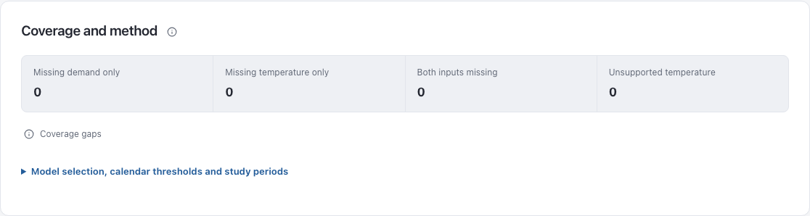

# Dashboard interface polish — 26 September 2026

## Scope and coverage

Reviewed the six main Next.js/React pages: Overview, Explore (energy, weather, peaks and profiles), Regional (comparison, peaks and snow), Patterns (all six analyses), Forecasts and Methods. These comprise 16 primary views. Reused the existing CSS tokens, Radix/shadcn components and chart libraries; followed AGENTS.md, the dashboard UI workflow and the implementation plan's analytical/accessibility requirements.

Browser review used the local synthetic fixture, not production observations. Captured settled views at 1440px and 390px in both themes, plus 320px in light mode. Expanded Methods sections and weather filters, inspected the 320px calendar, and checked the isolated chart trial route for page overflow. Existing browser tests cover saved reliability/ablation results, drawers, errors, loading and empty states.

| Domain | Evidence inspected | Result |
| --- | --- | --- |
| Accessibility | Control names, keyboard help/selects, Escape, focus, touch targets, reduced motion and browser suite | Corrected duplicated help wording; retained visible disclosure markers and focus |
| Layout | All 16 views, mobile filters, regional map and coverage panel | Corrected crowded controls, panel adjacency and mobile wrapping |
| Writing | Help labels, study introductions, source navigation | Clearer coverage help and concise study context; analytical limitations retained |
| Typography | Rendered control labels, headings, metrics and narrow layouts | Preserved system font and tabular values; improved wrapping and mobile native inputs |
| Color | Shared light/dark tokens, selected controls, metric icons and tinted support surfaces | Restrained existing accents; measured contrast passes for changed shared text/surface pairs |
| UI polish | Help icon variants, action/disclosure styles, charts and responsive map | Lightweight help, consistent spacing and visible disclosure cues |

## Findings resolved

| Severity | Domain | Location | Before | After | Why |
| --- | --- | --- | --- | --- | --- |
| Medium | UI polish | `frontend/components/analysis.css:41`, `frontend/components/help.css:32` | Generic action styling could turn help into a filled rectangular button | Shared action rules exclude help and styled inputs; icon help has a 32px target | Prevent competing styles across pages |
| Medium | Layout | `frontend/app/diagnostics/demand-anomalies-view.tsx:317` | Unlabeled icon directly below coverage strip | Labeled, spaced coverage-help row | Makes the relationship and action clear |
| Medium | Layout | `frontend/components/analysis.css`, `frontend/components/region-comparison.css` | Tight filter/action gaps; overview regional panel touched preceding content | Consistent gaps, padding and vertical separation | Space communicates grouping |
| Medium | Layout | `frontend/app/regional/page.tsx:566`, `frontend/app/regional/regional.module.css` | Tall mobile map with overlapping vertical key; controls wrapped unevenly | Responsive map, horizontal mobile key, three aligned tabs and five region buttons | Gives the map and controls usable space |
| Medium | Layout | `frontend/app/methods/page.tsx`, `frontend/app/forecasts/*` | Source links and dense secondary controls competed for space | Spaced source navigation and grouped forecast controls/disclosures | Keeps secondary actions discoverable and distinct |
| Low | UI polish | `frontend/app/explore/explore-client.tsx:266` | UTC axis title crowded the zoom slider | More space below the plot | Keeps chart labels separate from controls |

## Verification

- `npm run typecheck`: passed.
- `npm run test:e2e`: production build and all 55 browser tests passed, including exports, URL/history state, keyboard controls, themes, forecast studies and failure recovery.
- Targeted development-build rerun after final disclosure styling: all 7 forecast ablation/review tests passed.
- `git diff --check`: passed.
- No page-level horizontal overflow in the 80 settled primary-view captures. Wide tables retain their own scroll areas.
- Regional map checked while resizing 390 → 1440 → 320px; desktop layout restores correctly.
- Coverage help opens on keyboard focus and closes with Escape. Reduced-motion press feedback computes to `transform: none`.
- Measured shared contrast (light/dark): text on muted surface 13.23/12.89; muted text on muted surface 4.84/6.31; accent on accent-soft 5.88/7.27.

Not verified: physical touch devices, Safari/Firefox, screen-reader speech, RTL localization or browser-native 200% zoom. Backend calculations and source data were not changed. This report validates the local implementation; it does not establish a production deployment.

## Screenshots

Synthetic fixture examples, captured locally:

[Regional map and controls at 390px](screenshots/ui-polish-2026-09-26/regional-mobile.png)

## Verdict

Approve within the inspected scope. No unresolved blocking finding was identified in the reviewed flows; the unverified platform checks above remain outside this review.
