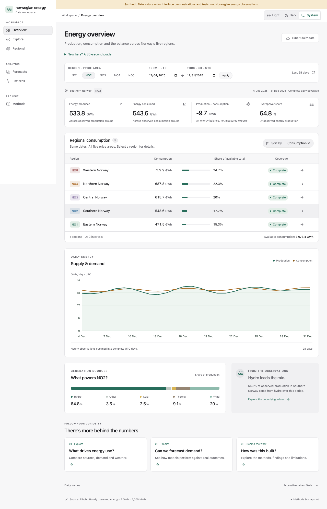
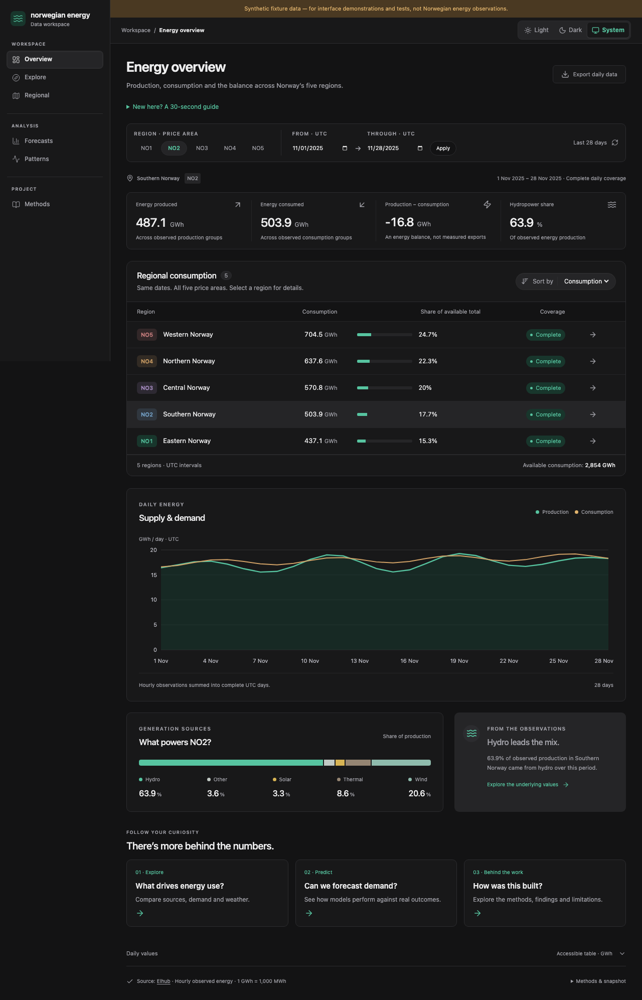
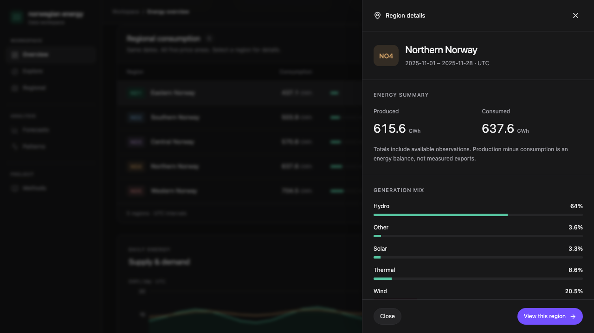
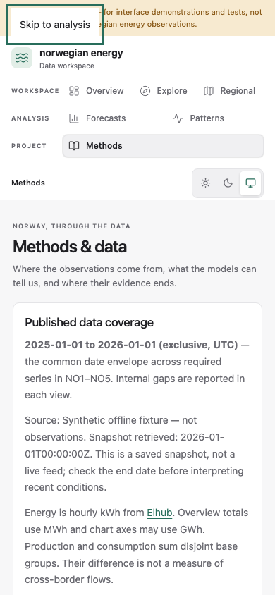

# Release candidate screenshots

Updated after the [portfolio UI refresh](../UI_DESIGN.md), 2026-09-15. Captured from the local production test build using the deterministic **synthetic offline fixture**. These images demonstrate the interface, not Norwegian observations or measured forecasting performance. They are not screenshots of a public deployment.

## Desktop overview

NO2 selected, with daily supply/demand, regional comparison and production mix. The browser journey also checks the downloaded CSV against the selected API values.

## Dark overview

A second NO2 date window, shown in dark mode. Theme choice also follows the operating system when System is selected.

## Region detail drawer

NO4 inspected while the overview remains on NO1. The panel uses the same date window and presents energy totals, generation mix and source coverage. Escape closes it and returns keyboard focus to the originating row.

## Mobile methods and keyboard navigation

390-pixel viewport, showing source coverage and the focused skip link. The journey checks keyboard focus and absence of horizontal overflow.

Regenerate with the browser command in [release operations](../RELEASE.md). Fresh screenshots are written under ignored `frontend/test-results/`; update this small gallery only after inspecting them. CI retains each run’s browser evidence for seven days.
